###### Assignment and Exercise for Data Warehouse Course at HCMUT
#### Semester 2023 - 2

> Student: Trung Nguyen Viet - Instructor: M. Eng Duc Tien Bui

> Developed with Python 3.11.x, PostgresSQL 12.x - PG Admin 7.x(if needed), Apache Nifi 1.27.x,
> following pip dependencies packages as below.

### Setup Note - Decision Suppport Module

1. Download pip package in terminal/command line: ```pip install faker pandas configparser coloredlogs psycopg2 jupyter squarify seaborn scikit-learn```

2. Type in command line/terminal ```jupyter notebook```

3. Run a Jupyter notebook file as usual

### Setup Note - Data Warehouse Module

1. Update Database config and connection info in `dwh_pipelines/config.ini`

2. Manually create databases with the same name as `config.ini` in your database instance

3. Install dependencies: ```pip install faker pandas configparser coloredlogs psycopg2 jupyter squarify seaborn scikit-learn```

4. Run python script:  ```python gen_staging.py``` create dimension table ```python gen_fact.py``` generate fact table for data mart


##### Theory: Basic components of an Data Warehouse

This Example use the **Inmon Approach** in designing data warehouse, some details layer would not completely follow the method.
 
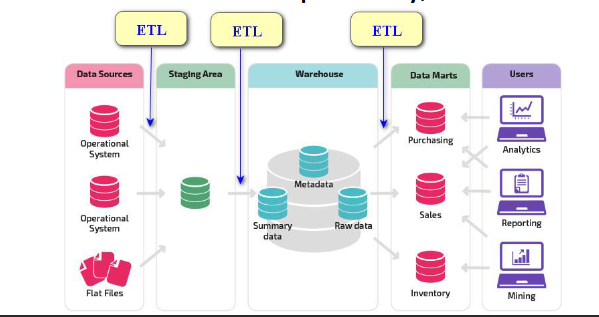


##### Exercises on Data pipelines

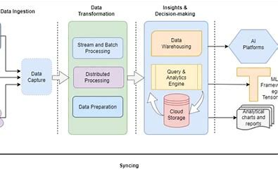


### Example of Data Pipeline using Data Tools - Apache Nifi

> A simple data pipeline of Generating a file and Sending to local filesystem

1. Create and Setting up first Processor of type GenerateFlowFile

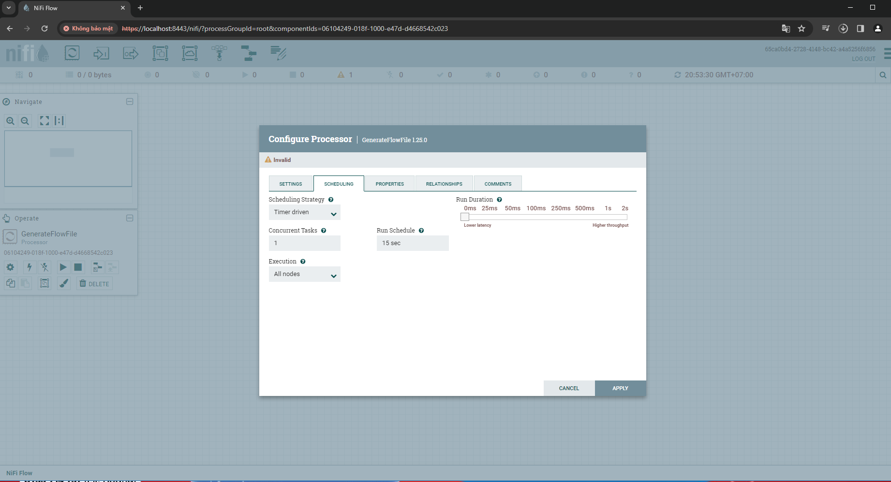:


2. Create and Setting up f2nd Processor of type PutFile:


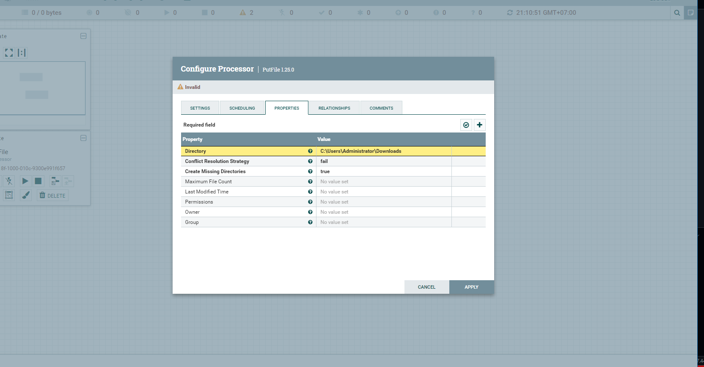

3. Start 2 processor to run the pipeline

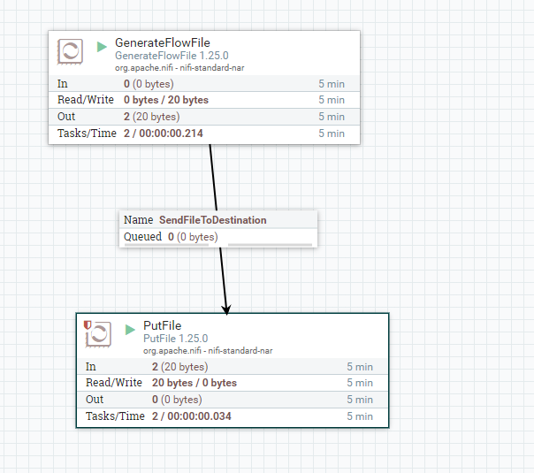


4.  Check Data Provenance

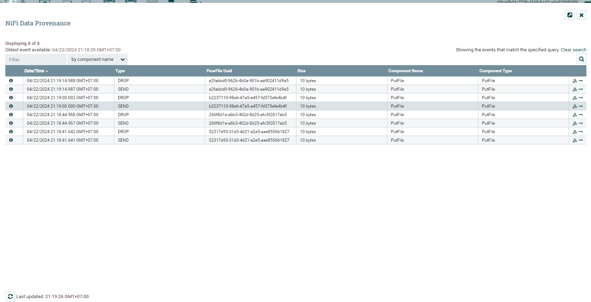


### Example of Data Pipeline using Cloud Service - Azure Data Factory


> A simple data pipeline of type "Copy Activity" to transform from CSV to Azure SQL table

##### Một số bước đáng chú ý:

1. Tạo tài nguyên Blob Storage trong 1 module quản lý Account Storage

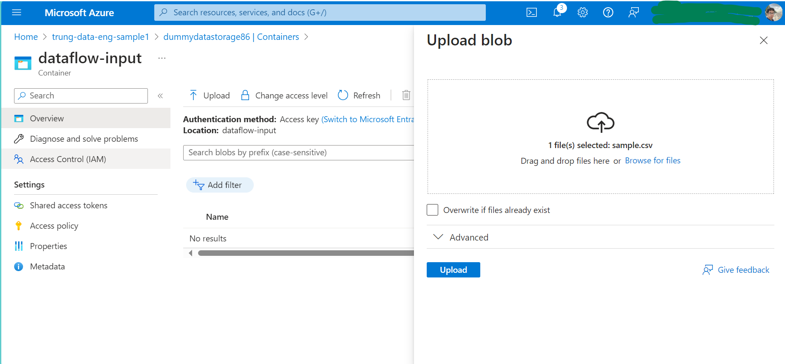

2. Tạo các Linked Service để kết nối đến các Dataset

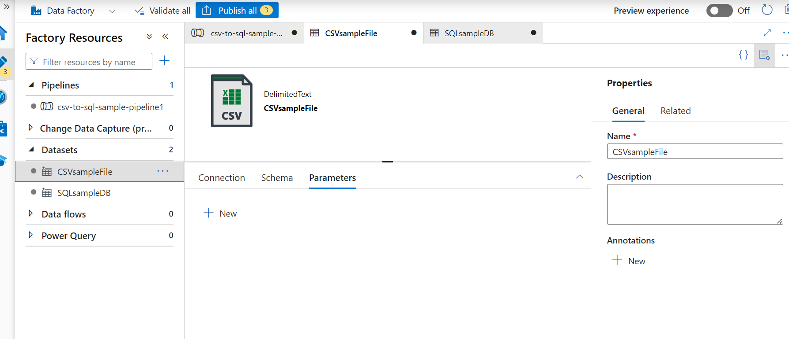
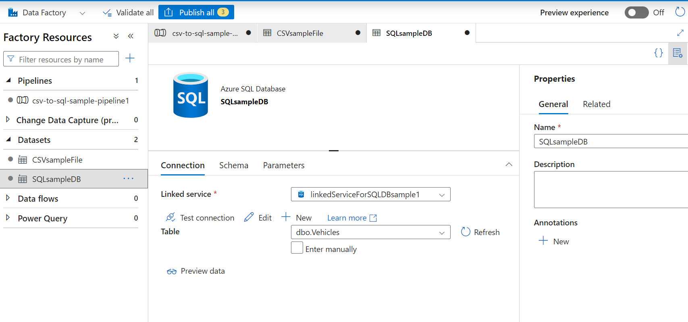

3. Tạo các Dataset Source và Sink(nguồn và đích) cho mỗi Activity

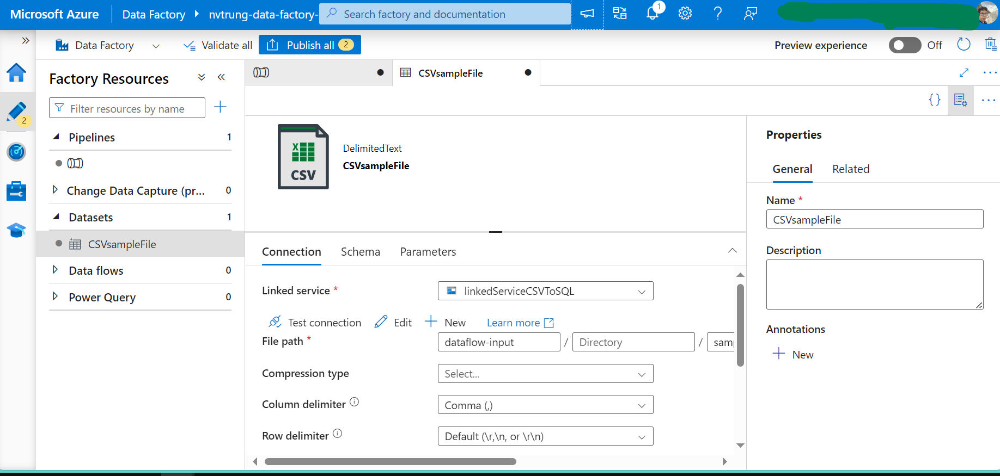

4. Thêm Activity(Copy) và Import Mapping

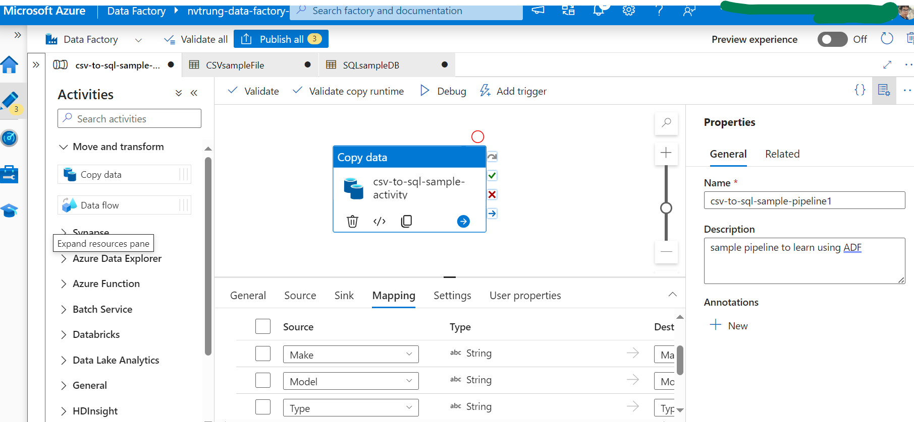


Tham khảo:

1. [Azure 4 Everyone](https://azure4everyone.com/)
2. [Data piplines with Spotify's Luigi](https://dev.to/mpangrazzi/data-pipelines-with-luigi-87d)
3. [Stephen David William Blog](https://stephendavidwilliams.com/how-i-created-a-postgres-data-warehouse-with-python-sql)
4. [Arvutiteaduse instituudi kursused](https://courses.cs.ut.ee/2023/cloud/spring/Main/Practice9)
