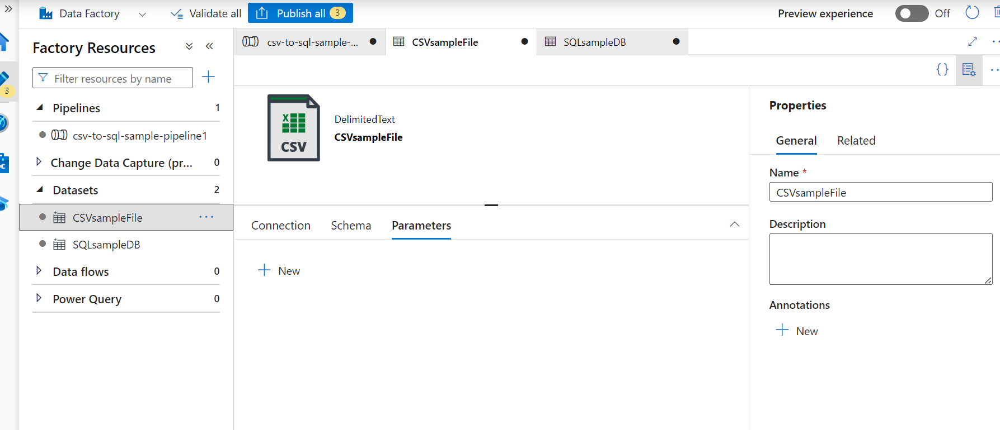
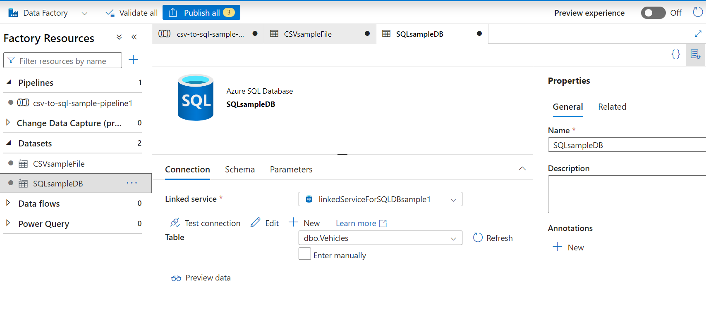

### Create data pipelines with Azure Data Factory

> A simple data pipeline of type "Copy Activity" to transform from CSV to Azure SQL table

##### Some key step

1. Create Blob Storage within an Account Storage

2. Create Linked Service and Datasets

3. Create Source & Sink Datasets

4. Add Activity to Pipeline and Import Mapping

